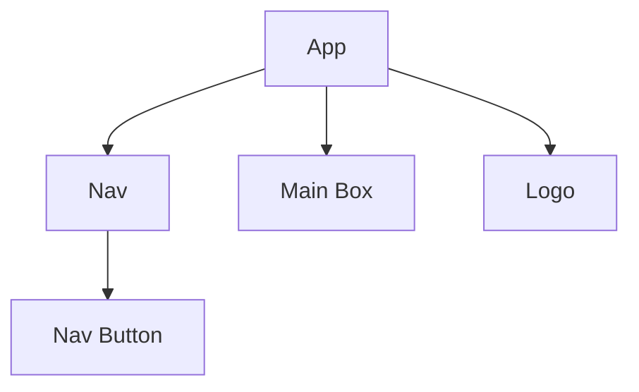

# Front End Plan
## Wireframe and component structure
### Wireframe Layout
### Components
*(Please add to this!)*

## Testing Plan
We will use Jest for unit tests, and Cypress for E2E tests.
What we'll test, how, and why.
### Unit Tests
Our unit tests will be written with Jest in a tests folder inside the src folder of our frontend. 
We will use Jest to test:
- If components render (with or without props)
- How components render with state changes
- How components react to user interactions
#### Happy Path
### Integration Tests? 
### E2E Tests
#### Happy Path
- User can properly select video, choose color, set threshold, and click submit
- When a user selects a video ...
    - update page structure
    - First frame loads
- When a user selects target color...
    - initialize/update binarized frame
    - centroid updates
- When user changes threshold ...
    - initialize/update binarized frame
    - centroid updates
- When user selects run...
    - sends a request to API (maybe an integration test?)
    - Loading starts
- Each of the nav buttons leads to proper route
    - pick a different video
#### Unhappy Path
#### Edge Case
