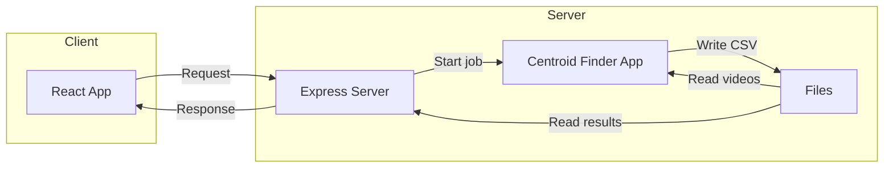

# Server Plan
## Server Structure
*Note: Refer to web-api project from SDEV 328 for reference to create API paths. Refer to express-project from SDEV 328 for router-controller logic.*

Our basic file structure will loosely look like this:
```
server/
├── .env <-- *
├── controllers/
    ├── controller.js <-- logic 
├── node_modules/
├── routers/
    ├── router.js <-- define routes
├── package-lock.json
├── package.json
└── server.js <-- set up server
```
**Store paths to video directory and videoProcessor.jar here, and use dotenv in server to access this.*

In **server.js**, we will mount the main router:
```
import router from './router/router.js';
...
app.use("/", router);
```
In **router.js**, we will access logic data from the controller. We will define methods and paths (GET at the /food path below is an example).
```
import express from 'express';
import controller from '.controllers/controller.js';

const { getFood, getColor } = controller;

const router = express.Router();
router.get("/food", getFood);
router.get("/color/:colorChoice", getColor);

export default router;
```
In **controller.js**, we will define logic for routes. Example:
```
const statusOK = 200;
const statusServerError = 500;

const getFood = (req, res) => {
    const food = ["pizza"];

    res.status(statusOK);
    res.json(food)
}

const getColor = (req, res) => {
    const color = req.params.colorChoice;
    const isFavorite = req.query.favorite;

    res.status(statusOK);
    if (isFavorite) {
        res.send(`${color} is a lovely color!`)
    } else {
        res.send(`You chose: ${color}.`)
    }
    
}
```
## Project Architecture

## Salamander API Summary
### Summary
Information about Salamander API found here: https://github.com/auberonedu/salamander-api

Routes:
- GET /api/videos
- GET /thumbnail/{filename}
    - *Hint: Use ffmpeg to fetch first frame*
- POST /process/{filename}
    - *Hint: Use UUID to generate jobIDs*
- GET /process/{jobId}/status

### Details

#### List Available Videos

**GET** `/api/videos`

**Description:**  
Return a list of all video files in the mounted directory, available publicly at /videos/VIDEO_NAME.

**Responses:**

- **200 OK**

  ```json
  ["intro.mp4", "demo.mov"]
  ```

- **500 Internal Server Error**

  ```json
  {
    "error": "Error reading video directory"
  }
  ```

---

#### Generate Thumbnail

**GET** `/thumbnail/{filename}`

**Path Parameters:**

- `filename` (string, required) — Name of the video file (e.g. `demo.mov`)

**Description:**  
Extract and return the first frame from the video as a JPEG.

**Responses:**

- **200 OK**  
  JPEG binary data  
  _Content-Type: image/jpeg_


- **500 Internal Server Error**

  ```json
  {
    "error": "Error generating thumbnail"
  }
  ```

---

#### Start Video Processing Job

**POST** `/process/{filename}`  
_Query parameters:_ `?targetColor=<hex>&threshold=<int>`

**Path Parameters:**

- `filename` (string, required) — Name of the video file to process (e.g. `intro.mp4`)

**Query Parameters:**

- `targetColor` (string, required) — Hex color code to match (e.g. `ff0000`)
- `threshold`   (number, required) — Match threshold (e.g. `120`)

**Description:**  
Kick off an asynchronous job to analyze the video. Returns a `jobId` you can poll.

**Responses:**

- **202 Accepted**

  ```json
  {
    "jobId": "123e4567-e89b-12d3-a456-426614174000"
  }
  ```

- **400 Bad Request**

  ```json
  {
    "error": "Missing targetColor or threshold query parameter."
  }
  ```


- **500 Internal Server Error**

  ```json
  {
    "error": "Error starting job"
  }
  ```

---

#### Get Processing Job Status

**GET** `/process/{jobId}/status`

**Path Parameters:**

- `jobId` (string, required) — ID returned by the **POST** `/process` call

**Description:**  
Check whether the job is still running, has completed, or failed.

**Responses:**

- **200 OK** (processing)

  ```json
  {
    "status": "processing"
  }
  ```

- **200 OK** (done)

  ```json
  {
    "status": "done",
    "result": "/results/intro.mp4.csv"
  }
  ```

- **200 OK** (error)

  ```json
  {
    "status": "error",
    "error": "Error processing video: Unexpected ffmpeg error"
  }
  ```

- **404 Not Found**

  ```json
  {
    "error": "Job ID not found"
  }
  ```

- **500 Internal Server Error**

  ```json
  {
    "error": "Error fetching job status"
  }
  ```